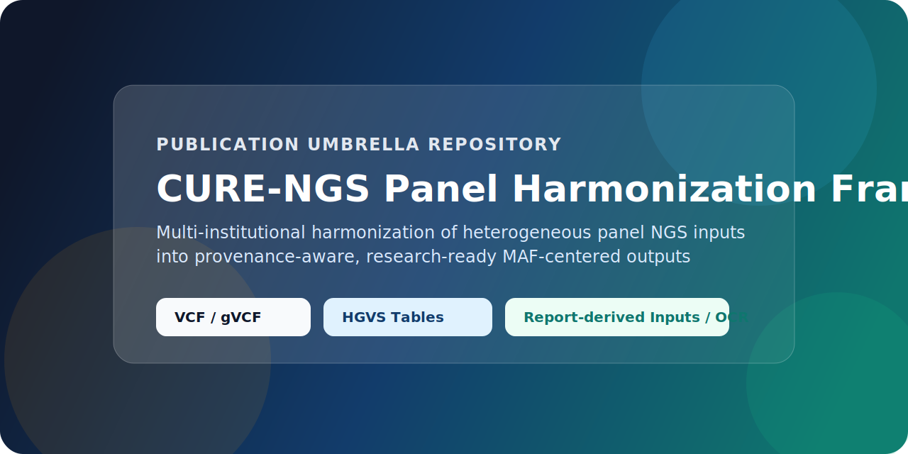
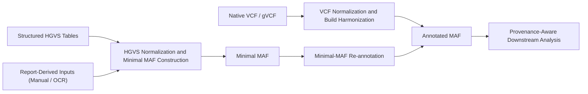

  

  
  
  
  

# CURE-NGS Panel Harmonization Framework

This repository is the publication-facing umbrella repository for the manuscript "Multi-Institutional Harmonization Framework for Heterogeneous Panel-Based NGS in Precision Oncology."

It provides one stable project home page for:

- manuscript metadata and declarations
- reproducibility notes
- software inventory
- licensing and citation metadata
- links to the component repositories maintained under the `NCDCbioinformatics` account

## At a Glance

- Exact manuscript project URL: `https://github.com/NCDCbioinformatics/cure-ngs-panel-harmonization-framework`
- Framework scope: heterogeneous panel NGS harmonization into provenance-aware MAF-centered outputs
- Main routes: VCF or gVCF, structured HGVS tables, and report-derived inputs from manual abstraction or OCR
- Current role of this repo: umbrella documentation and publication metadata, not patient-level data distribution

## Framework Map

## Component Repositories

| Repository | Role in the framework | Primary implementation |
| --- | --- | --- |
| [panel_VCF_vcf2maf_pipeline](https://github.com/NCDCbioinformatics/panel_VCF_vcf2maf_pipeline) | VCF preprocessing, build harmonization, and VCF-to-MAF conversion | Bash shell with external bioinformatics tools |
| [HGVS_to_minimal_MAF_pipeline](https://github.com/NCDCbioinformatics/HGVS_to_minimal_MAF_pipeline) | HGVS-driven minimal MAF generation | Bash shell and Python |
| [minimal_MAF_to_annotated_MAF_pipeline](https://github.com/NCDCbioinformatics/minimal_MAF_to_annotated_MAF_pipeline) | Minimal-MAF-to-annotated-MAF conversion | Bash shell and Python |
| [gene_name_harmonization](https://github.com/NCDCbioinformatics/gene_name_harmonization) | Gene symbol normalization utility | Python |
| [gene_fusion_normalizer](https://github.com/NCDCbioinformatics/gene_fusion_normalizer) | Fusion gene name normalization utility | Python |
| [hgvs_normerlizer](https://github.com/NCDCbioinformatics/hgvs_normerlizer) | HGVS nomenclature normalization utility | Python |

## Software Environment

- Operating systems: Linux environments are the primary supported target; Windows users can operate through WSL when needed.
- Programming languages: Bash shell and Python.
- External requirements: `bcftools`, `samtools`, `Picard`, `Ensembl VEP`, `vcf2maf`, and standard Python packages used by individual component tools.

## Publication and Editorial Metadata

- Manuscript-ready declarations: [docs/MANUSCRIPT_DECLARATIONS.md](docs/MANUSCRIPT_DECLARATIONS.md)
- Software inventory summary: [docs/SOFTWARE_INVENTORY.md](docs/SOFTWARE_INVENTORY.md)
- Citation metadata: [CITATION.cff](CITATION.cff)
- Data availability note: [data/README.md](data/README.md)
- License clarification: [NOTICE.md](NOTICE.md)

## Data and Code Availability

This manuscript describes a methodological and software framework. No new patient-level CURE-NGS dataset is publicly released through this repository. Patient-level data are not distributed here.

Public code availability is provided through this umbrella repository together with the component repositories listed above.

## Why the GitHub Sidebar May Look Different

GitHub's language bar is calculated automatically from source files on the default branch. Because this umbrella repository is intentionally documentation-heavy, it may not show the same language profile as software-first repositories. The configured GitHub Actions workflows and badges above are the meaningful quality indicators for this repository.

## License

This repository currently uses the MIT License for code and documentation authored for the project.

Important clarification:

- MIT is appropriate for original code and original documentation that your team owns.
- Bundled example inputs, benchmark materials, or other third-party-derived files may remain subject to their original source terms.
- Review [NOTICE.md](NOTICE.md) before redistributing example materials.

## Citation

See [CITATION.cff](CITATION.cff).
