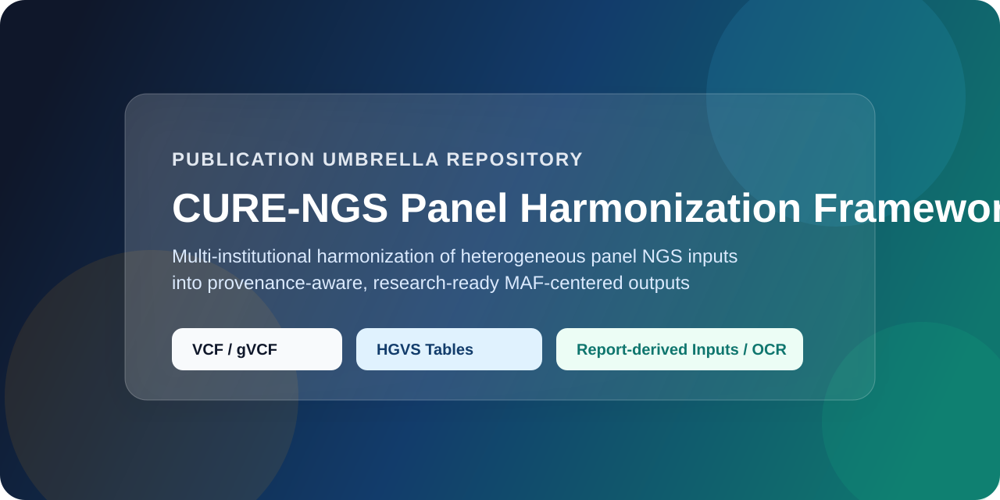
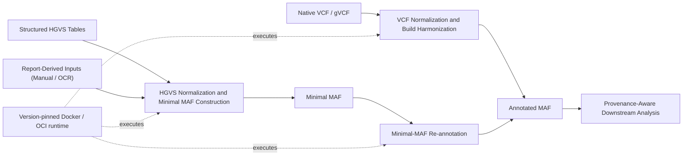

<p align="center">
  
</p>

<p align="center">
  <a href="https://github.com/NCDCbioinformatics/cure-ngs-panel-harmonization-framework/actions/workflows/repo-health.yml"></a>
  <a href="https://github.com/NCDCbioinformatics/cure-ngs-panel-harmonization-framework/actions/workflows/tests.yml"></a>
  <a href="https://github.com/NCDCbioinformatics/cure-ngs-panel-harmonization-framework/actions/workflows/link-check.yml"></a>
  <a href="https://github.com/NCDCbioinformatics/cure-ngs-panel-harmonization-framework/blob/main/LICENSE"></a>
  <a href="https://github.com/NCDCbioinformatics/cure-ngs-panel-harmonization-framework/blob/main/docs/MANUSCRIPT_DECLARATIONS.md"></a>
</p>

# CURE-NGS Panel Harmonization Framework

This repository is the publication-facing and executable software repository for
the manuscript "Multi-Institutional Harmonization Framework for Heterogeneous
Panel-Based NGS in Precision Oncology."

It provides one stable project home page for:

- the supported `cure-ngs-harmonizer` 0.2.3 command-line package
- digest- and version-pinned core and full Docker images
- synthetic fixtures, automated tests, and continuous integration
- aggregate technical-validation results and their figure-generation script
- manuscript metadata and declarations
- reproducibility notes
- software inventory
- licensing and citation metadata
- provenance links to the six historical component repositories

## At a Glance

- Exact manuscript project URL: `https://github.com/NCDCbioinformatics/cure-ngs-panel-harmonization-framework`
- Framework scope: heterogeneous panel NGS harmonization into provenance-aware MAF-centered outputs
- Main routes: VCF or gVCF, structured HGVS tables, and report-derived inputs from manual abstraction or OCR
- Current role of this repo: supported revision software, tests, containers, and publication metadata; no patient-level data distribution

## Project Organization and Repository Roles

CURE-NGS is **one supported software product** assembled from capabilities that
were originally developed in six component repositories. This umbrella
repository is the canonical installation, testing, issue-reporting, and
publication location. The component repositories preserve release and
development provenance; reviewers do not need to configure six separate
environments.

| Repository | Responsibility in CURE-NGS | Supported unified entry point | Latest audited component release |
| --- | --- | --- | --- |
| **[cure-ngs-panel-harmonization-framework](https://github.com/NCDCbioinformatics/cure-ngs-panel-harmonization-framework)** | Canonical project home, unified CLI, Docker/OCI images, tests, reviewer data, validation, and manuscript metadata | `cure-ngs` / `scripts/run_reviewer_demo.sh` | Consolidated release `0.2.3` |
| [panel_VCF_vcf2maf_pipeline](https://github.com/NCDCbioinformatics/panel_VCF_vcf2maf_pipeline) | VCF sanitation, assembly handling, and VCF-to-MAF conversion | `cure-ngs normalize-vcf` and `cure-ngs vcf-to-maf` | `NCDC_batch_vcf2maf_V.1.3.3_github` |
| [HGVS_to_minimal_MAF_pipeline](https://github.com/NCDCbioinformatics/HGVS_to_minimal_MAF_pipeline) | Structured/report-derived HGVS to minimal MAF | `cure-ngs hgvs-table-to-minimal-maf` | `minimal_maf_vep_hg38tohg19_V.1.0.3` |
| [minimal_MAF_to_annotated_MAF_pipeline](https://github.com/NCDCbioinformatics/minimal_MAF_to_annotated_MAF_pipeline) | Minimal MAF conversion and re-annotation | `cure-ngs minimal-maf-to-vcf` and `cure-ngs annotate-vcf` | `minimal_maf_to_vep_maf_V.1.0.2` |
| [gene_name_harmonization](https://github.com/NCDCbioinformatics/gene_name_harmonization) | Gene-symbol harmonization using GTF and HGNC | `cure-ngs normalize-gene` | `gene_normalizer_human` / release 0.2.1 |
| [gene_fusion_normalizer](https://github.com/NCDCbioinformatics/gene_fusion_normalizer) | Direction-preserving fusion-gene normalization | `cure-ngs normalize-fusion` | `gene_fusion_normalizer` / release 0.2.1 |
| [hgvs_normerlizer](https://github.com/NCDCbioinformatics/hgvs_normerlizer) | Tabular HGVS nomenclature normalization | `cure-ngs normalize-hgvs-table` | `hgvsnorm-cli-0.2.2.tar` |

The supported deployment is therefore a single version-pinned container, not
six independently configured containers. Exact release commits and asset
SHA-256 values are recorded in
[`resources/components.lock.json`](resources/components.lock.json) and checked
against GitHub by CI. See [Project structure and repository policy](docs/PROJECT_STRUCTURE.md)
for the ownership, integration, versioning, and reviewer workflow in detail.

## Download and Install

### 1. Install a container engine

- Windows or macOS: install [Docker Desktop](https://docs.docker.com/desktop/).
- Linux: install [Docker Engine](https://docs.docker.com/engine/install/).
- Podman is also supported; replace `docker` with `podman` in the commands.

For an otherwise empty Ubuntu 22.04 or 24.04 machine, follow the exact
[clean-Ubuntu installation procedure](docs/INSTALLATION.md#clean-ubuntu-2204-or-2404)
before continuing.

Confirm that the engine is running:

```bash
docker version
docker run --rm hello-world
```

If either command reports `permission denied while trying to connect to the
Docker daemon socket at unix:///var/run/docker.sock`, Docker is running but the
current Linux/WSL user cannot access it. Configure non-root access once, then
open a new group session:

```bash
sudo groupadd -f docker
sudo usermod -aG docker "$USER"
newgrp docker
docker info
```

On WSL, if the old group membership remains after reopening Ubuntu, run
`wsl --shutdown` once in **Windows PowerShell**, reopen Ubuntu, and retry
`docker info`. Do not use `chmod 777 /var/run/docker.sock`. See
[Docker socket troubleshooting](docs/TROUBLESHOOTING.md#permission-denied-for-varrundockersock)
for diagnosis and institutional-security considerations.

### 2. Obtain CURE-NGS

The source-build route is available immediately and is the reproducible option
for a commit or pull request:

```bash
git clone https://github.com/NCDCbioinformatics/cure-ngs-panel-harmonization-framework.git
cd cure-ngs-panel-harmonization-framework
CORE_IMAGE=ghcr.io/ncdcbioinformatics/cure-ngs-harmonizer:0.2.3-core
FULL_IMAGE=ghcr.io/ncdcbioinformatics/cure-ngs-harmonizer:0.2.3
docker build --file docker/Dockerfile.core --tag "$CORE_IMAGE" .
docker build --file docker/Dockerfile --tag "$FULL_IMAGE" .
```

The release images can be downloaded without building locally:

```bash
CORE_IMAGE=ghcr.io/ncdcbioinformatics/cure-ngs-harmonizer:0.2.3-core
FULL_IMAGE=ghcr.io/ncdcbioinformatics/cure-ngs-harmonizer:0.2.3
docker pull "$CORE_IMAGE"
docker pull "$FULL_IMAGE"
```

Both images are public and do not require `docker login`. Their published tags
and digests are visible on the
[GitHub Packages page](https://github.com/NCDCbioinformatics/cure-ngs-panel-harmonization-framework/pkgs/container/cure-ngs-harmonizer).

### 3. Verify the installation

```bash
CORE_IMAGE=ghcr.io/ncdcbioinformatics/cure-ngs-harmonizer:0.2.3-core
FULL_IMAGE=ghcr.io/ncdcbioinformatics/cure-ngs-harmonizer:0.2.3
docker run --rm "$FULL_IMAGE" versions
docker run --rm "$CORE_IMAGE" doctor --profile core
bash scripts/verify_public_install.sh
```

Keep the complete `ghcr.io/ncdcbioinformatics/...` image name when running a
downloaded image. A short name such as `cure-ngs-harmonizer:0.2.3` is a
different local tag and may make Docker query Docker Hub instead of GHCR.

The core reviewer test needs no human reference download. Full VCF-to-MAF
annotation requires a separately mounted GRCh37 FASTA and release-matched VEP
116 cache; follow [Reference and annotation data](docs/REFERENCE_DATA.md).

### Restored NCDC V1.3.3 batch conversion

Release 0.2.0 and later restore the operational behavior of
`NCDC_batch_vcf2maf_V.1.3.3` as a portable command. Large FASTAs, VEP caches,
and liftover chains stay outside the image and are mounted read-only. Their
relative paths, ordered FASTA fallback, and ordered chain fallback are declared
in `references/reference-config.json` instead of being hard-coded for one
workstation.

The program does not guess among arbitrary files elsewhere on the host. The
config defines the auditable candidate set; automatic selection happens only
inside that set. `doctor-bundle` verifies resolved paths, GRCh37/GRCh38 primary
chromosome lengths, contig style, chain direction and target compatibility,
Picard dictionaries, VEP cache identity, and installed-VEP/cache release
compatibility before analysis.

Choose the host directory explicitly; the container never searches outside it.
The left side of `--volume` is the user's real disk/NAS path and the right side
is the stable path seen by CURE-NGS:

```bash
REFERENCE_DIR=/path/to/your/reference-store
FULL_IMAGE=ghcr.io/ncdcbioinformatics/cure-ngs-harmonizer:0.2.3
mkdir -p config

docker run --rm --user "$(id -u):$(id -g)" \
  --volume "$PWD/config:/config" \
  "$FULL_IMAGE" init-reference-config \
  /config/reference-config.json --reference-root /references

# Edit config/reference-config.json if the files use different relative paths.
docker run --rm \
  --volume "$REFERENCE_DIR:/references:ro" \
  --volume "$PWD/config:/config:ro" \
  "$FULL_IMAGE" doctor-bundle \
  --reference-config /config/reference-config.json \
  --reference-root /references \
  | tee reference-bundle.preflight.json

mkdir -p "$PWD/KOSMOS_VCF/VCF_ALL"
# Put one or more .vcf/.vcf.gz/.g.vcf files in KOSMOS_VCF/VCF_ALL.

docker run --rm --read-only --tmpfs /tmp:size=2g,mode=1777 \
  --user "$(id -u):$(id -g)" \
  --volume "$PWD/KOSMOS_VCF:/data/KOSMOS_VCF" \
  --volume "$REFERENCE_DIR:/references:ro" \
  --volume "$PWD/config:/config:ro" \
  "$FULL_IMAGE" batch-vcf-to-maf \
  --workspace-root /data/KOSMOS_VCF \
  --reference-config /config/reference-config.json \
  --reference-root /references --jobs 4
```

The command creates and uses the same layout shown in the manuscript and in
`NCDC_batch_vcf2maf_V.1.3.3_github`:

```text
KOSMOS_VCF/
|-- VCF_ALL/       # original user VCFs
|-- VCF_ALL_LOG/   # vcf2maf_batch_log.tsv, summary, manifests
|-- VCF_ALL_MAF/   # one <sanitized-input-name>.maf per VCF
`-- VCF_ALL_TMP/   # processed VCFs, VEP/vcf2maf temp files and logs
```

To see that structure immediately without downloading the large reference
assets, export the bundled non-clinical 25-record VCF and validated 25-row
reference MAF to a local bind mount:

```bash
mkdir -p "$PWD/tutorial-layout"
docker run --rm --user "$(id -u):$(id -g)" \
  --volume "$PWD/tutorial-layout:/data/output" \
  "$CORE_IMAGE" export-v1.3.3-example /data/output/KOSMOS_VCF
find "$PWD/tutorial-layout/KOSMOS_VCF" -maxdepth 3 -type f -print
```

The exported log uses `REFERENCE_OUTPUT`, so it cannot be mistaken for a new
VEP run. The full-image command above performs the actual annotation.

GRCh37 is the default target. GRCh38 inputs are detected and lifted with the
configured chain candidates; GRCh37 inputs bypass liftover. The batch command
also restores gVCF filtering, legacy GINS/header repair, empty-VCF handling,
eight-character sample tags, parallel jobs, per-file manifests, and a TSV/JSON
batch report. In V1.3.3 layout mode, the TSV retains the exact manuscript
columns `datetime`, `vcf_path`, `sample_tag8`, `ref_info`, `is_gvcf`,
`has_normal`, `status`, `message`, and `final_vcf`. See the
[V1.3.3 batch workflow guide](docs/V1.3.3_BATCH_WORKFLOW.md).

## First-time user tutorial

New users can download the public core image and exercise the functions mapped
from all six historical components with the repository's non-clinical examples:

```bash
git clone https://github.com/NCDCbioinformatics/cure-ngs-panel-harmonization-framework.git
cd cure-ngs-panel-harmonization-framework
bash scripts/run_beginner_tutorial.sh
```

Windows PowerShell:

```powershell
powershell -ExecutionPolicy Bypass -File scripts/run_beginner_tutorial.ps1
```

The image contains the original public test files from all six component
repositories. The launcher verifies their SHA-256 hashes, copies the inputs and
non-empty historical reference outputs into the timestamped local output
folder, and processes the complete 2,625-row HGVS workbook. To export only the
data bundle from a downloaded image:

```bash
mkdir -p tutorial-data
docker run --rm --user "$(id -u):$(id -g)" \
  --volume "$PWD/tutorial-data:/data/output" \
  ghcr.io/ncdcbioinformatics/cure-ngs-harmonizer:0.2.3-core \
  export-tutorial-data /data/output/component-test-data
```

The one-command run requires no human reference genome or VEP cache. The
[beginner tutorial](docs/BEGINNER_TUTORIAL.md) explains every input, command,
expected result, output file, and the optional full GRCh37/VEP annotation step.

## Reviewer Quick Start

A reviewer can verify the software without installing Python, VEP, or a human
reference genome on the host:

```bash
git clone https://github.com/NCDCbioinformatics/cure-ngs-panel-harmonization-framework.git
cd cure-ngs-panel-harmonization-framework
bash scripts/run_reviewer_demo.sh
```

Windows PowerShell:

```powershell
powershell -ExecutionPolicy Bypass -File scripts/run_reviewer_demo.ps1
```

The walkthrough builds the pinned core image, disables container networking,
exports and verifies the original public test bundle from all six historical
components, and runs deterministic checks including the complete 2,625-row
HGVS workbook. The 25-record VCF and non-empty 25-row reference MAF are kept
together; the valid-empty VCF is clearly separated as an edge case. Expected
final message: `Reviewer demonstration passed`.

Start here for a clean installation:

- [Beginner six-component tutorial](docs/BEGINNER_TUTORIAL.md)
- [Installation and deployment](docs/INSTALLATION.md)
- [Reference genome, VEP cache, chain, GTF, and HGNC setup](docs/REFERENCE_DATA.md)
- [Commands and end-to-end workflows](docs/COMMAND_REFERENCE.md)
- [Restored NCDC V1.3.3 batch workflow](docs/V1.3.3_BATCH_WORKFLOW.md)
- [Reviewer reproduction checklist](docs/REVIEWER_REPRODUCTION.md)
- [Clean Ubuntu validation record](docs/CLEAN_UBUNTU_VALIDATION.md)
- [Troubleshooting](docs/TROUBLESHOOTING.md)

## Framework Map


```mermaid
flowchart LR
    A["Native VCF / gVCF"] --> B["VCF Normalization and Build Harmonization"]
    D["Structured HGVS Tables"] --> E["HGVS Normalization and Minimal MAF Construction"]
    F["Report-Derived Inputs (Manual / OCR)"] --> E
    B --> C["Annotated MAF"]
    E --> G["Minimal MAF"]
    G --> H["Minimal-MAF Re-annotation"]
    H --> C
    C --> I["Provenance-Aware Downstream Analysis"]
    J["Version-pinned Docker / OCI runtime"] -. executes .-> B
    J -. executes .-> E
    J -. executes .-> H
```

## Developer Quick Start

The Python package supports Python 3.10–3.12. Development installation and the
complete test suite are:

```bash
python -m pip install --upgrade pip==25.0.1
python -m pip install --requirement requirements-runtime.txt
python -m pip install --requirement requirements-test.txt
python -m pip install --no-deps --editable .
python -m pytest --cov=cure_ngs --cov-fail-under=70
```

The current suite collects 95 tests (93 passed and 2 bcftools-dependent tests
skip only on hosts without bcftools) and exceeds the required 70% branch-aware
coverage floor. The Linux container job separately runs the complete beginner
six-component walkthrough under hardened container settings.

Inspect a synthetic VCF and report all inferred properties:

```bash
cure-ngs inspect-vcf tests/fixtures/synthetic/multiallelic.grch38.vcf
```

Normalize against a declared reference. This validates REF, splits
multiallelics, left-aligns indels, removes exact duplicates, and writes an
auditable manifest:

```bash
cure-ngs normalize-vcf input.vcf normalized.vcf.gz \
  --reference-fasta /references/hg19.fa --assembly GRCh37
```

## Containerized Runtime

Build the full VEP/vcf2maf image:

```bash
docker build --file docker/Dockerfile \
  --tag cure-ngs-harmonizer:0.2.3 .
docker run --rm --read-only --tmpfs /tmp:size=64m \
  --security-opt no-new-privileges:true \
  cure-ngs-harmonizer:0.2.3 versions
```

The image runs as non-root UID/GID 10001. It pins Python 3.10.12, bcftools 1.13,
SAMtools 1.13, Ensembl VEP 116.1, Picard 3.1.1, and vcf2maf commit
`754d68ab4ad3eba29199c5a62e0061745aed7e7e`. Base images use immutable digests;
downloaded artifacts, wheels, and reference profiles use SHA-256 validation.
The smaller `docker/Dockerfile.core` image supports preprocessing, table
normalization, and concordance without VEP, Picard, or vcf2maf.

The image contains software dependencies but intentionally excludes large
reference assets. Before an institutional run, mount the institution's FASTA,
FAI, optional Picard dictionary/liftover chain, release-matched VEP cache, GTF,
and HGNC table as required. Authoritative download links and exact directory
layouts are provided in [the reference-data guide](docs/REFERENCE_DATA.md).

Check the mounted environment before analysis:

```bash
FULL_IMAGE=ghcr.io/ncdcbioinformatics/cure-ngs-harmonizer:0.2.3
docker run --rm \
  --volume "$PWD/references:/references:ro" \
  "$FULL_IMAGE" doctor \
  --profile vcf-to-maf --assembly GRCh37 \
  --reference-fasta /references/grch37/hg19.fa \
  --vep-data /references/vep --cache-version 116
```

## Technical Validation

`validation/` contains aggregate results for 12 technical caller,
file-route, and genome-build fixtures—**not patient samples**. After
multiallelic splitting, reference validation, and left normalization, the
HGVS-evaluable comparison yielded:

| Metric | Value |
| --- | ---: |
| Direct-route evaluable unique variants | 2,149 |
| Report-HGVS unique variants | 2,108 |
| Concordant | 2,095 |
| Direct only | 54 |
| Report only | 13 |
| Sensitivity | 97.49% |
| Positive predictive value | 99.38% |
| Jaccard agreement | 96.90% |
| F1 | 98.43% |

See [the technical-validation README](validation/README.md), the aggregate JSON,
the per-fixture TSV, and the script that generates revised Figure 4. Synthetic
cross-route fixtures included under `tests/fixtures/synthetic/` yield 100% exact
set agreement and require no patient data.

## Six-Component Release Baseline

The repository-role table above identifies every audited component release and
its supported unified command. The baseline was resolved from each
repository's current `releases/latest` API response on 15 August 2026. Exact
release IDs, tag-resolved commit SHAs, asset
sizes, and SHA-256 digests are frozen in
[`resources/components.lock.json`](resources/components.lock.json). CI verifies
that all six locks still identify the current latest releases. See the
[`component release baseline`](docs/COMPONENT_RELEASE_BASELINE.md) for the full
audit and integration interpretation. The unified `cure-ngs` interface in this
repository is the supported revision release; the six repositories remain the
versioned behavioral and development provenance.

## Software Environment

- Operating systems: Linux environments are the primary supported target; Windows users can operate through WSL when needed.
- Programming language: Python, with external bioinformatics executables invoked as argument arrays.
- Exact external requirements: recorded in `resources/tools.lock.json`, the Dockerfiles, and command manifests.
- Reference policy: GRCh37/hg19 is the CURE-NGS deployment default because it matches the predominant assembly used by the Korean clinical panel workflows expected by the program and therefore minimizes avoidable coordinate conversion. GRCh38 remains fully supported through an explicit `--target-assembly GRCh38` selection, including for WGS-oriented or future migration workflows. The default is an interoperability policy, not a claim that GRCh37 is technically superior to GRCh38.

## Publication and Editorial Metadata

- Manuscript-ready declarations: [docs/MANUSCRIPT_DECLARATIONS.md](docs/MANUSCRIPT_DECLARATIONS.md)
- Software inventory summary: [docs/SOFTWARE_INVENTORY.md](docs/SOFTWARE_INVENTORY.md)
- Citation metadata: [CITATION.cff](CITATION.cff)
- Data availability note: [data/README.md](data/README.md)
- Public and synthetic reviewer data: [examples/README.md](examples/README.md)
- License clarification: [NOTICE.md](NOTICE.md)

## Data and Code Availability

This manuscript describes a methodological and software framework. No new patient-level CURE-NGS dataset is publicly released through this repository. Patient-level data are not distributed here.

Public code availability, synthetic tests, containers, aggregate technical
validation, and an attributed public GRCh37 VCF used in local testing are
provided directly through this repository. No CURE-NGS patient-level data are
included. The component repositories listed above remain available for
development provenance.

## Why the GitHub Sidebar May Look Different

GitHub's language bar is calculated automatically from source files on the default branch. Because this umbrella repository is intentionally documentation-heavy, it may not show the same language profile as software-first repositories. The configured GitHub Actions workflows and badges above are the meaningful quality indicators for this repository.

## License

This repository currently uses the MIT License for code and documentation authored for the project.

Important clarification:

- MIT is appropriate for original code and original documentation that your team owns.
- Bundled example inputs, benchmark materials, or other third-party-derived files may remain subject to their original source terms.
- Review [NOTICE.md](NOTICE.md) before redistributing example materials.

## Citation

See [CITATION.cff](CITATION.cff).
