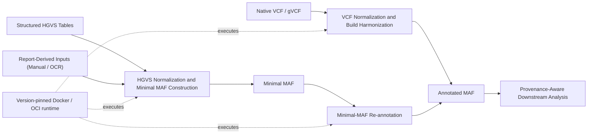

<p align="center">
  
</p>

<p align="center">
  <a href="https://github.com/NCDCbioinformatics/cure-ngs-panel-harmonization-framework/actions/workflows/repo-health.yml"></a>
  <a href="https://github.com/NCDCbioinformatics/cure-ngs-panel-harmonization-framework/actions/workflows/tests.yml"></a>
  <a href="https://github.com/NCDCbioinformatics/cure-ngs-panel-harmonization-framework/actions/workflows/link-check.yml"></a>
  <a href="https://github.com/NCDCbioinformatics/cure-ngs-panel-harmonization-framework/blob/main/LICENSE"></a>
  <a href="https://github.com/NCDCbioinformatics/cure-ngs-panel-harmonization-framework/blob/main/docs/MANUSCRIPT_DECLARATIONS.md"></a>
</p>

# CURE-NGS Panel Harmonization Framework

This repository is the publication-facing and executable software repository for
the manuscript "Multi-Institutional Harmonization Framework for Heterogeneous
Panel-Based NGS in Precision Oncology."

It provides one stable project home page for:

- the supported `cure-ngs-harmonizer` 0.1.0 command-line package
- digest- and version-pinned core and full Docker images
- synthetic fixtures, automated tests, and continuous integration
- aggregate technical-validation results and their figure-generation script
- manuscript metadata and declarations
- reproducibility notes
- software inventory
- licensing and citation metadata
- provenance links to the six historical component repositories

## At a Glance

- Exact manuscript project URL: `https://github.com/NCDCbioinformatics/cure-ngs-panel-harmonization-framework`
- Framework scope: heterogeneous panel NGS harmonization into provenance-aware MAF-centered outputs
- Main routes: VCF or gVCF, structured HGVS tables, and report-derived inputs from manual abstraction or OCR
- Current role of this repo: supported revision software, tests, containers, and publication metadata; no patient-level data distribution

## Framework Map


```mermaid
flowchart LR
    A["Native VCF / gVCF"] --> B["VCF Normalization and Build Harmonization"]
    D["Structured HGVS Tables"] --> E["HGVS Normalization and Minimal MAF Construction"]
    F["Report-Derived Inputs (Manual / OCR)"] --> E
    B --> C["Annotated MAF"]
    E --> G["Minimal MAF"]
    G --> H["Minimal-MAF Re-annotation"]
    H --> C
    C --> I["Provenance-Aware Downstream Analysis"]
    J["Version-pinned Docker / OCI runtime"] -. executes .-> B
    J -. executes .-> E
    J -. executes .-> H
```

## Quick Start

The Python package supports Python 3.10–3.12. Development installation and the
complete test suite are:

```bash
python -m pip install --requirement requirements-runtime.txt
python -m pip install --requirement requirements-test.txt
python -m pip install --no-deps --editable .
python -m pytest --cov=cure_ngs --cov-fail-under=70
```

The Linux core container passed all 65 tests with 77.10% branch-aware coverage. Native
Windows runs 63 platform-independent tests and skips the two tests that require
`bcftools`; both skipped tests pass in the Linux container.

Inspect a synthetic VCF and report all inferred properties:

```bash
cure-ngs inspect-vcf tests/fixtures/synthetic/multiallelic.grch38.vcf
```

Normalize against a declared reference. This validates REF, splits
multiallelics, left-aligns indels, removes exact duplicates, and writes an
auditable manifest:

```bash
cure-ngs normalize-vcf input.vcf normalized.vcf.gz \
  --reference-fasta /references/hg19.fa --assembly GRCh37
```

## Containerized Runtime

Build the full VEP/vcf2maf image:

```bash
docker build --file docker/Dockerfile \
  --tag cure-ngs-harmonizer:0.1.0 .
docker run --rm --read-only --tmpfs /tmp:size=64m \
  --security-opt no-new-privileges:true \
  cure-ngs-harmonizer:0.1.0 versions
```

The image runs as non-root UID/GID 10001. It pins Python 3.10.12, bcftools 1.13,
SAMtools 1.13, Ensembl VEP 116.1, Picard 3.1.1, and vcf2maf commit
`754d68ab4ad3eba29199c5a62e0061745aed7e7e`. Base images use immutable digests;
downloaded artifacts, wheels, and reference profiles use SHA-256 validation.
The smaller `docker/Dockerfile.core` image supports preprocessing, table
normalization, and concordance without VEP, Picard, or vcf2maf.

## Technical Validation

`validation/` contains aggregate results for 12 technical caller,
file-route, and genome-build fixtures—**not patient samples**. After
multiallelic splitting, reference validation, and left normalization, the
HGVS-evaluable comparison yielded:

| Metric | Value |
| --- | ---: |
| Direct-route evaluable unique variants | 2,149 |
| Report-HGVS unique variants | 2,108 |
| Concordant | 2,095 |
| Direct only | 54 |
| Report only | 13 |
| Sensitivity | 97.49% |
| Positive predictive value | 99.38% |
| Jaccard agreement | 96.90% |
| F1 | 98.43% |

See [the technical-validation README](validation/README.md), the aggregate JSON,
the per-fixture TSV, and the script that generates revised Figure 4. Synthetic
cross-route fixtures included under `tests/fixtures/synthetic/` yield 100% exact
set agreement and require no patient data.

## Historical Component Repositories

| Repository | Role in the framework | Primary implementation |
| --- | --- | --- |
| [panel_VCF_vcf2maf_pipeline](https://github.com/NCDCbioinformatics/panel_VCF_vcf2maf_pipeline) | VCF preprocessing, build harmonization, and VCF-to-MAF conversion | Bash shell with external bioinformatics tools |
| [HGVS_to_minimal_MAF_pipeline](https://github.com/NCDCbioinformatics/HGVS_to_minimal_MAF_pipeline) | HGVS-driven minimal MAF generation | Bash shell and Python |
| [minimal_MAF_to_annotated_MAF_pipeline](https://github.com/NCDCbioinformatics/minimal_MAF_to_annotated_MAF_pipeline) | Minimal-MAF-to-annotated-MAF conversion | Bash shell and Python |
| [gene_name_harmonization](https://github.com/NCDCbioinformatics/gene_name_harmonization) | Gene symbol normalization utility | Python |
| [gene_fusion_normalizer](https://github.com/NCDCbioinformatics/gene_fusion_normalizer) | Fusion gene name normalization utility | Python |
| [hgvs_normerlizer](https://github.com/NCDCbioinformatics/hgvs_normerlizer) | HGVS nomenclature normalization utility | Python |

The repositories below preserve the development history. The unified
`cure-ngs` interface in this repository is the supported revision release.

## Software Environment

- Operating systems: Linux environments are the primary supported target; Windows users can operate through WSL when needed.
- Programming language: Python, with external bioinformatics executables invoked as argument arrays.
- Exact external requirements: recorded in `resources/tools.lock.json`, the Dockerfiles, and command manifests.
- Reference policy: GRCh37/hg19 is the CURE-NGS deployment default because it matches the predominant assembly used by the Korean clinical panel workflows expected by the program and therefore minimizes avoidable coordinate conversion. GRCh38 remains fully supported through an explicit `--target-assembly GRCh38` selection, including for WGS-oriented or future migration workflows. The default is an interoperability policy, not a claim that GRCh37 is technically superior to GRCh38.

## Publication and Editorial Metadata

- Manuscript-ready declarations: [docs/MANUSCRIPT_DECLARATIONS.md](docs/MANUSCRIPT_DECLARATIONS.md)
- Software inventory summary: [docs/SOFTWARE_INVENTORY.md](docs/SOFTWARE_INVENTORY.md)
- Citation metadata: [CITATION.cff](CITATION.cff)
- Data availability note: [data/README.md](data/README.md)
- License clarification: [NOTICE.md](NOTICE.md)

## Data and Code Availability

This manuscript describes a methodological and software framework. No new patient-level CURE-NGS dataset is publicly released through this repository. Patient-level data are not distributed here.

Public code availability, synthetic tests, containers, and aggregate technical
validation are provided directly through this repository. The component
repositories listed above remain available for development provenance.

## Why the GitHub Sidebar May Look Different

GitHub's language bar is calculated automatically from source files on the default branch. Because this umbrella repository is intentionally documentation-heavy, it may not show the same language profile as software-first repositories. The configured GitHub Actions workflows and badges above are the meaningful quality indicators for this repository.

## License

This repository currently uses the MIT License for code and documentation authored for the project.

Important clarification:

- MIT is appropriate for original code and original documentation that your team owns.
- Bundled example inputs, benchmark materials, or other third-party-derived files may remain subject to their original source terms.
- Review [NOTICE.md](NOTICE.md) before redistributing example materials.

## Citation

See [CITATION.cff](CITATION.cff).
