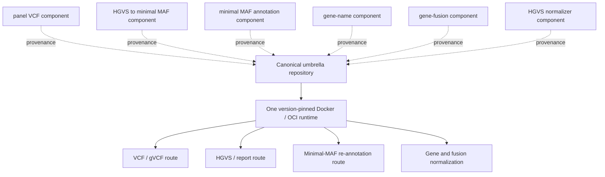

# Project structure and repository policy

## Canonical project identity

The canonical CURE-NGS software and manuscript repository is:

`https://github.com/NCDCbioinformatics/cure-ngs-panel-harmonization-framework`

This is the location that reviewers and external institutions should clone,
test, cite, and use to report reproducibility problems. It contains the
supported `cure-ngs` CLI, core and full container recipes, automated tests,
non-clinical examples, technical validation, and publication metadata.

## Why seven repositories are listed

Six component repositories record the development history and published
release assets of the original functions. They are not six additional products
that a reviewer must install. Their current supported functions are
consolidated into the umbrella repository as follows:

| Historical repository | Consolidated capability | Unified command |
| --- | --- | --- |
| `panel_VCF_vcf2maf_pipeline` | VCF inspection, sanitation, multiallelic decomposition, left alignment, optional liftover, and MAF annotation | `inspect-vcf`, `normalize-vcf`, `vcf-to-maf` |
| `HGVS_to_minimal_MAF_pipeline` | HGVS-table conversion with explicit GRCh37/GRCh38 handling and auditable REST caching | `hgvs-table-to-minimal-maf` |
| `minimal_MAF_to_annotated_MAF_pipeline` | Reference-valid per-sample VCF generation and annotation | `minimal-maf-to-vcf`, `annotate-vcf` |
| `gene_name_harmonization` | GTF/HGNC-backed gene-symbol normalization | `normalize-gene` |
| `gene_fusion_normalizer` | Direction-preserving fusion normalization | `normalize-fusion` |
| `hgvs_normerlizer` | CSV/TSV/XLSX HGVS field normalization | `normalize-hgvs-table` |

## Runtime relationship

The container supplies the application and fixed executable versions. Large or
independently updated resources—human FASTA, FAI, Picard dictionary, VEP cache,
liftover chain, GTF, and HGNC data—remain external read-only mounts. This avoids
embedding multi-gigabyte reference data in every image and allows institutions
to record the exact resources used.

## Release and version policy

- `resources/components.lock.json` records the latest audited GitHub release
  identity, tag-resolved commit, asset URL, byte size, and SHA-256 for all six
  components.
- `resources/tools.lock.json`, the Dockerfiles, and Python requirement files pin
  the supported runtime dependencies.
- CI fails if a component's live latest release no longer matches the audited
  lock.
- Historical release assets are not silently rewritten. Revision fixes and
  integration tests are maintained in the consolidated package.
- GRCh37/hg19 is the operational default for current Korean panel
  interoperability; GRCh38 remains an explicit supported assembly.

## Reviewer workflow

1. Clone only the canonical umbrella repository.
2. Run `bash scripts/run_reviewer_demo.sh` or the PowerShell equivalent.
3. Inspect `versions.json`, `doctor.json`, generated manifests, and concordance
   outputs under `reviewer-output/`.
4. For a full VEP/vcf2maf run, install the external GRCh37 FASTA and matching
   VEP 116 cache described in `docs/REFERENCE_DATA.md`.
5. Cite the umbrella release or immutable commit SHA. Use the six component
   release identities only as implementation provenance.

Detailed commands are in `docs/COMMAND_REFERENCE.md`; the complete independent
verification checklist is in `docs/REVIEWER_REPRODUCTION.md`.
